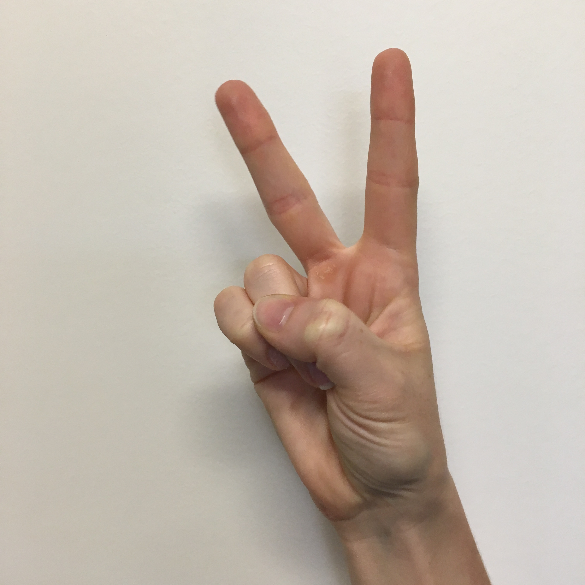

# Sign language image recognition and example of overfitting

**Key files**
- Main file [here](./sign-language-resnet50.ipynb)
- ResNet50 implementation can be found [here](./resnet_utils.py)

**Summary**

- We use a ResNet50 model to recognize how many fingers someone is holding up
- We import pre-trained weights from the Week 2 assignment of [Convolution Neural Networks](https://www.coursera.org/learn/convolutional-neural-networks/)
- We find that the Coursera model overfits on their data (~90% accuracy on their test set, but ~20% accuracy on the ["Turkey AAA (High School's Sign Language Digits) dataset"](https://github.com/ardamavi/Sign-Language-Digits-Dataset)
- We re-train the final layer of the network on a training set that includes samples from both the Coursera dataset and the Turkey AAA dataset
- Accuracy significantly improves on the Turkey AAA dataset (~53% on a test set) with negligible difference to accuracy on the Coursera dataset
- Note: re-training was only done over 3 epochs. We expect that if the model continued to train for several more epochs, the accuracy would improve

**Data**

- Example of image from Coursera dataset

- Example of image from Turkey AAA dataset dataset

